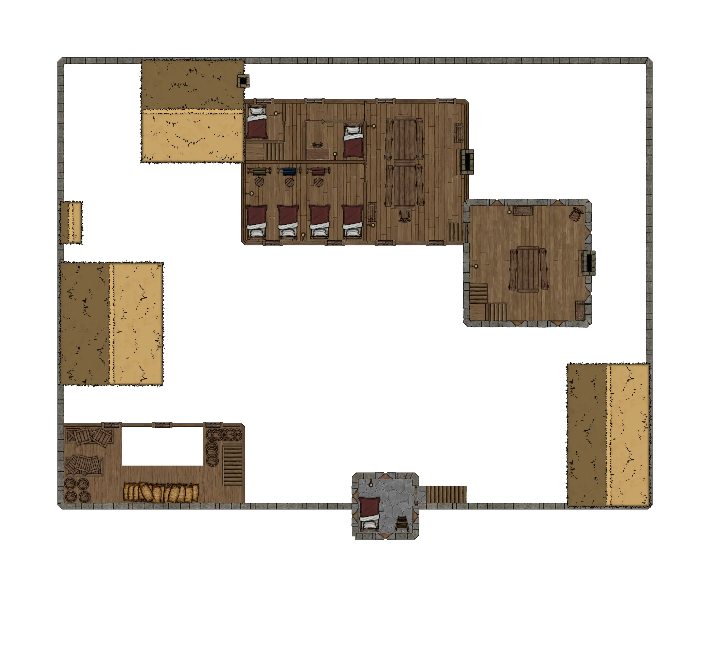

# HârnWorld Location Module: Hundholt

Hundholt Manor is a "Location Module" for the Foundry VTT system. This location module
is designed to depict the Hundholt Manor and Fethael Hundred moot in the far north of
he Kingdom of Kaldor, on the island of Hârn in the [HârnWorld](https://columbiagames.com/harnworld/) fantasy
setting; however, this manor could be adapted to exist anywhere in any fantasy setting.

Although designed for use with the [HârnMaster](https://foundryvtt.com/packages/hm3)
system, this module is mostly system-agnostic.  Detailed descriptions of the actors
has been provided in journal entries to facilitate conversion to other game systems.

# Maps

The original maps from this work have been used as inspiration, and new maps have been
designed specifically to meet the requirements of the VTT environment.  The following
maps are part of this module.

## Hundholt Village

Map of Hundholt Village, including the manor.

## Rawyn Farm

Ground level.

Upper level.

## Hundholt Manor

Ground level.

Upper level.

Top level.

Roof level.

# Credits

This module is made possible by the hard work of HârnWorld fans,
and is provided at no cost. This work is an adaptation of the article
[Hundholt](https://www.lythia.com/harnworld/settlements/hundholt/) available
at the HârnWorld fan site [Lythia.com](https://www.lythia.com/).

**Writer:** Joe Adams

**Original Maps:** George Kelln

**Heraldry:** Matthias Janssen

With Thanks to Robert Barfield

**Adapted to Foundry VTT:** Tom Rodriguez

This module is "[Fanon](https://www.lythia.com/about/publishing-fan-written-material/)",
a derivative work of copyrighted material by Columbia Games Inc. and N. Robin Crossby.

Some assets used to create the maps in this module are from
[Forgotton Adventures](https://www.forgotten-adventures.net/).
Illustrations by Richard Luschek; visit his Patreon page at https://www.patreon.com/LuschekII.
